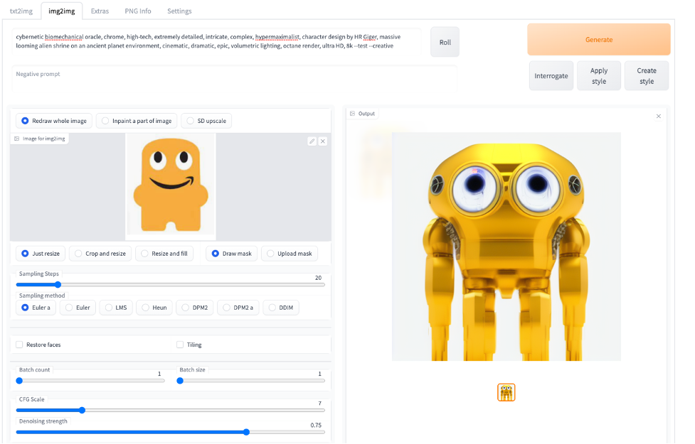
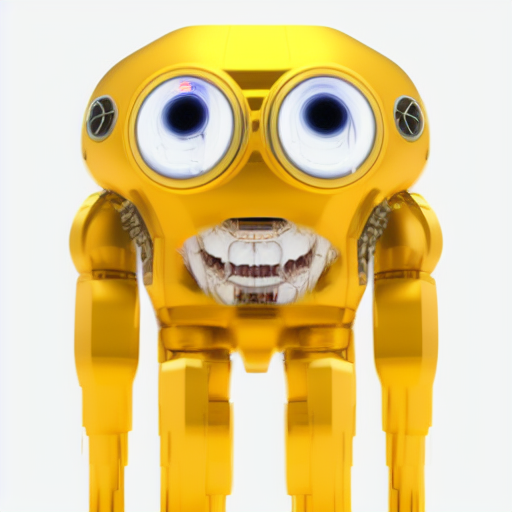
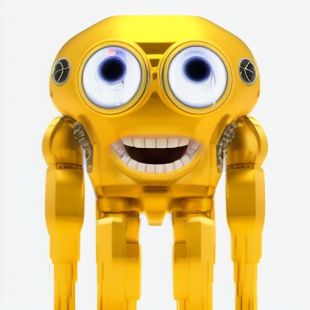
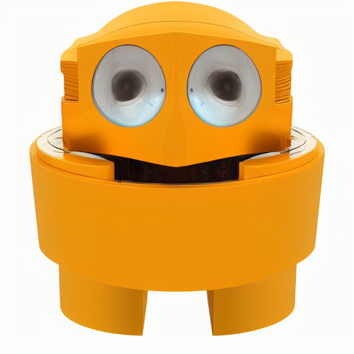
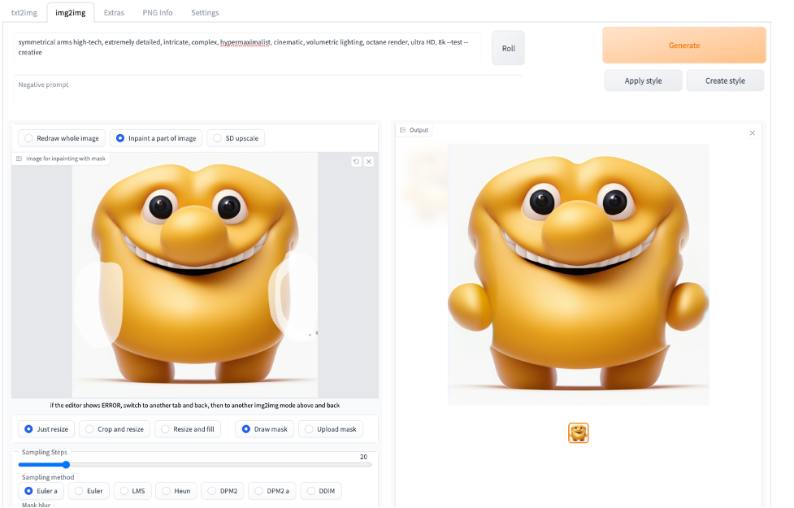

# Amazon Peccy In Real Life (IRL) 
Below you will find simple tutorial using Stable Diffusion's img2img to alter an image guided by a text prompt of your choosing. We will use Amazon's corporate mascot named 'Peccy' and the opinions of children to iterate and build out an entirely new image. The exercise took only 10 minutes of prompting and in-painting iterations.  


### Stable Diffusion img2img Alteration 
We start off by keeping all of the setting at their default. We upload the original Peccy image and then pass the following text prompt in order to generate a more realistic version of a 2D drawing: `cybernetic biomechanical oracle, chrome, high-tech, extremely detailed, intricate, complex, hypermaximalist, character design by HR Giger, massive looming alien shrine on an ancient planet environment, cinematic, dramatic, epic, volumetric lighting, octane render, ultra HD, 8k`.

After we hit the generate button, we see the following output:



The children immediately pointed out the difference in that there was no smile. In order to add a smile, we would need to perform in-painting in which we would then switch from the "Redraw whole image" radio button to the "Inpaint a part of the image" radio button. We then hilight the mouth area and pass a new text prompt for a smile (more on how to do this in below steps). Here are a couple iterations the kids saw: 

Mechanical Peccy Smile 1            |  Mechanical Peccy Smile 1 
:-------------------------:|:-------------------------:
  |   


Of course they preferred the last iterations smile but all voiced their displeasure with Peccy's appearance. We then navigated back to the "Redraw whole image" radio button and re-uploaded the original Peccy in search of a new candidate. This time we generated the following: 



This time the consensus was that Peccy should actually be "happy little man". We simply changed the text prompt and generated our new base avatar: `playful mascot smiling with perfect white teeth and natural lips, high-tech, extremely detailed, intricate, complex, hypermaximalist, cinematic, happy, volumetric lighting, octane render, ultra HD, 8k`.


The children loved him! They then pointed out that he did not have any arms. We naviagted back to the "Inpaint a part of the image" radio button and uploaded our latest iteration. From there, we hilighted both sides of him where the arms should appear and then passed the new similar prompt:  `symmetrical arms, high-tech, extremely detailed, intricate, complex, hypermaximalist, cinematic, happy, volumetric lighting, octane render, ultra HD, 8k`.





## Installation and Running
Make sure the required [dependencies](https://github.com/AUTOMATIC1111/stable-diffusion-webui/wiki/Dependencies) are met and follow the instructions available for both [NVidia](https://github.com/AUTOMATIC1111/stable-diffusion-webui/wiki/Install-and-Run-on-NVidia-GPUs) (recommended) and [AMD](https://github.com/AUTOMATIC1111/stable-diffusion-webui/wiki/Install-and-Run-on-AMD-GPUs) GPUs.

Alternatively, use [Google Colab](https://colab.research.google.com/drive/1Iy-xW9t1-OQWhb0hNxueGij8phCyluOh).

### Automatic Installation on Windows
1. Install [Python 3.10.6](https://www.python.org/downloads/windows/), checking "Add Python to PATH"
2. Install [git](https://git-scm.com/download/win).
3. Download the stable-diffusion-webui repository, for example by running `git clone https://github.com/AUTOMATIC1111/stable-diffusion-webui.git`.
4. Place `model.ckpt` in the base directory, alongside `webui.py`.
5. _*(Optional)*_ Place `GFPGANv1.3.pth` in the base directory, alongside `webui.py`.
6. Run `webui-user.bat` from Windows Explorer as normal, non-administrate, user.

### Automatic Installation on Linux
1. Install the dependencies:
```bash
# Debian-based:
sudo apt install wget git python3 python3-venv
# Red Hat-based:
sudo dnf install wget git python3
# Arch-based:
sudo pacman -S wget git python3
```
2. To install in `/home/$(whoami)/stable-diffusion-webui/`, run:
```bash
bash <(wget -qO- https://raw.githubusercontent.com/AUTOMATIC1111/stable-diffusion-webui/master/webui.sh)
```

## Documentation
The documentation was moved from this README over to the project's [wiki](https://github.com/AUTOMATIC1111/stable-diffusion-webui/wiki).

## Credits
- Stable Diffusion - https://github.com/CompVis/stable-diffusion, https://github.com/CompVis/taming-transformers
- k-diffusion - https://github.com/crowsonkb/k-diffusion.git
- GFPGAN - https://github.com/TencentARC/GFPGAN.git
- ESRGAN - https://github.com/xinntao/ESRGAN
- Ideas for optimizations - https://github.com/basujindal/stable-diffusion
- Doggettx - Cross Attention layer optimization - https://github.com/Doggettx/stable-diffusion, original idea for prompt editing.
- Idea for SD upscale - https://github.com/jquesnelle/txt2imghd
- CLIP interrogator idea and borrowing some code - https://github.com/pharmapsychotic/clip-interrogator
- Initial Gradio script - posted on 4chan by an Anonymous user. Thank you Anonymous user.
- (You)
