# Amazon Peccy In Real Life (IRL) 
Below you will find simple tutorial using Stable Diffusion's img2img to alter an image guided by a text prompt of one's own imagination. We will use Amazon's mascot named 'Peccy' and the opinions of children to iterate and build out an entirely new version of Peccy in real life (IRL). The exercise took ~20 minutes of prompting and inpainting iterations.  

[Unofficial Trailer](https://s3.amazonaws.com/robocarhack.com/Amazon+Peccy+IRL.mp4)

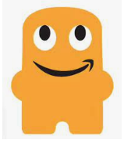

### Stable Diffusion img2img Alteration 
We start off by keeping all of the settings at their default values. We upload the original Peccy image and then pass the following text prompt in order to generate a more realistic version of a 2D drawing: `cybernetic biomechanical oracle, chrome, high-tech, extremely detailed, intricate, complex, hypermaximalist, character design by HR Giger, massive looming alien shrine on an ancient planet environment, cinematic, dramatic, epic, volumetric lighting, octane render, ultra HD, 8k`.

After we hit the generate button, we see the following output:

The children immediately pointed out the difference in that there was no smile. In order to add a smile, we would need to perform inpainting in which we would then switch from the "Redraw whole image" radio button to the "Inpaint a part of the image" radio button. We then highlighted the mouth area and passed a new text prompt for a smile (more on how to do this in below steps). Here are a couple iterations the kids saw: 

Mechanical Peccy Smile 1            |  Mechanical Peccy Smile 1 
:-------------------------:|:-------------------------:
  |   

Of course they preferred the last iteration's smile, but all voiced their displeasure with Peccy's appearance. We then navigated back to the "Redraw whole image" radio button and re-uploaded the original Peccy in search of a new candidate. This time we generated the following: 

This time, the consensus was that Peccy should actually be a "happy little man". We simply changed the text prompt and generated our new base avatar: `playful mascot smiling with perfect white teeth and natural lips, high-tech, extremely detailed, intricate, complex, hypermaximalist, cinematic, happy, volumetric lighting, octane render, ultra HD, 8k`.

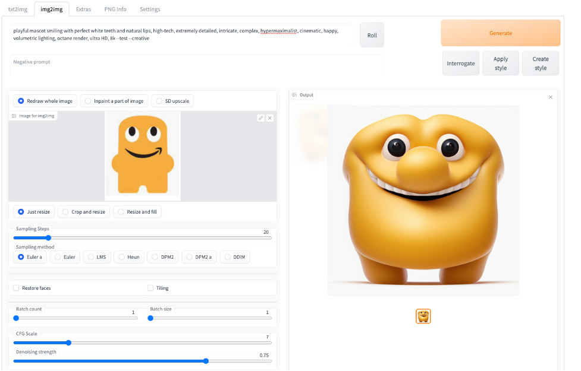

The children loved him! They then pointed out that he did not have any arms. We naviagted back to the "Inpaint a part of the image" radio button and uploaded our latest iteration. From there, we highlighted both sides of him where the arms should appear and then passed the new similar prompt:  `symmetrical arms, high-tech, extremely detailed, intricate, complex, hypermaximalist, cinematic, happy, volumetric lighting, octane render, ultra HD, 8k`.

They all laughed and one commeted on how the arms looked like potatoes! Here are a few other iterations that we generated:

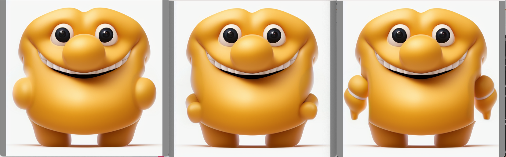 

The consensus was that the last iteration with the white stripe going through the bicep was the coolest, but, we need to remove the small "pointy" part. For this, we reverted back to inpainting so we can highlight (mask) those pointy parts of the arms and smooth them out with a new prompt. The result was exactly what they had imagined: 

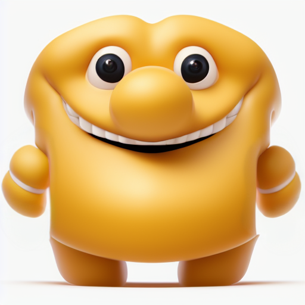 

The next question that arose was "What is he standing on?" Afer a small debate, they decided to have him walking on water. We inpainted again by setting the mask to replace the bottom portion of the screen, as well as the current "board" he was on top of, and passed a similar prompt as the ones used above but with water. Here are all of the various water iterations stable diffusion generated for us: 

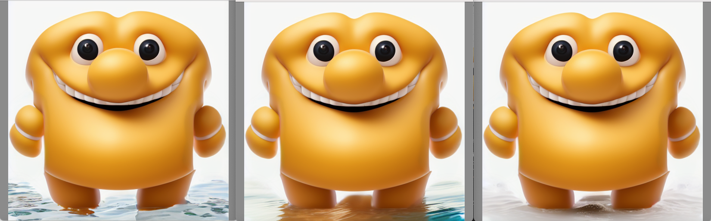 
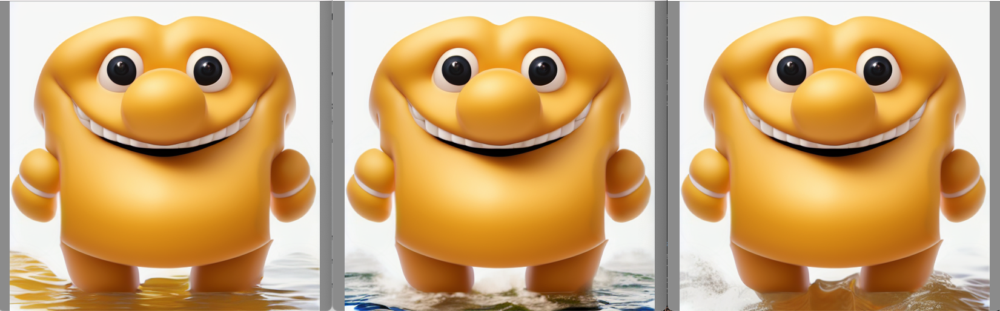 

The children all had different opinions on which they thought were the best, but after an executive decision was made, we moved forward with the first (top left) iteration shown. From there, they requested a palm tree to be added. We masked the top left of the image and updated the prompt with palm trees in it. Here are the three iterations: 

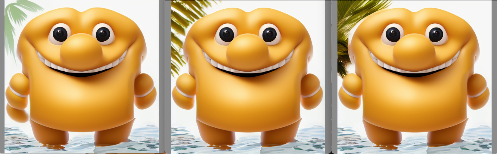 

They liked the last one, however, they wanted to fix the area between the left side of Peccy's head and their favortie palm tree. We masked the image in that exact spot, updated the prompt, and generated a better version. 

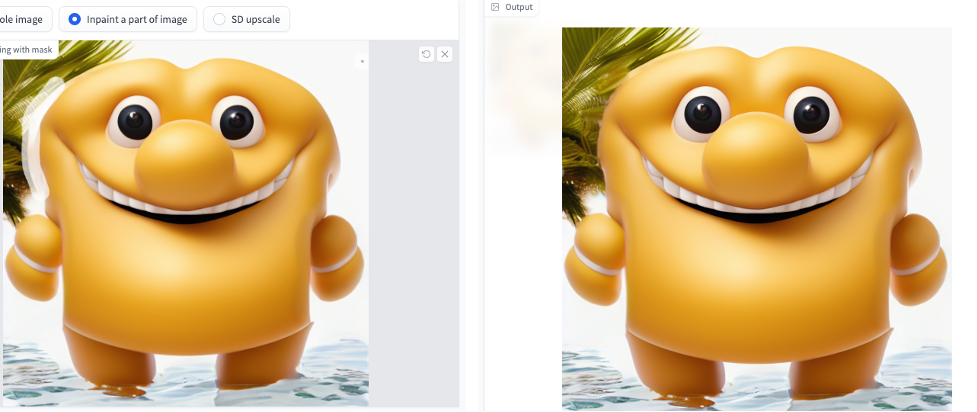 

They then discussed how Peccy is at the beach and might need some hair to cover his head from the sun. After inpainting and a new prompt we did just that. I know it's not a lot, but it is all he has :rofl: 

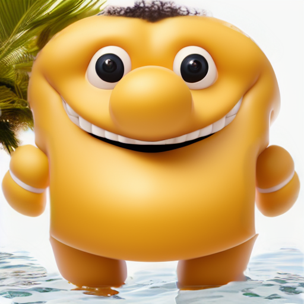 

And now getting back to that sunset. We were able to inpaint and mask the top right of the background and then add a new prompt for a sunset. 

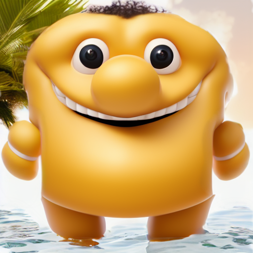 

The children then spoke about how Peccy was a native on a remote island living his best life. He just needed a little bit mroe swag to prove it. They decided on a gold medallion being held together by a cultural necklace. We started with the gold medallion: 

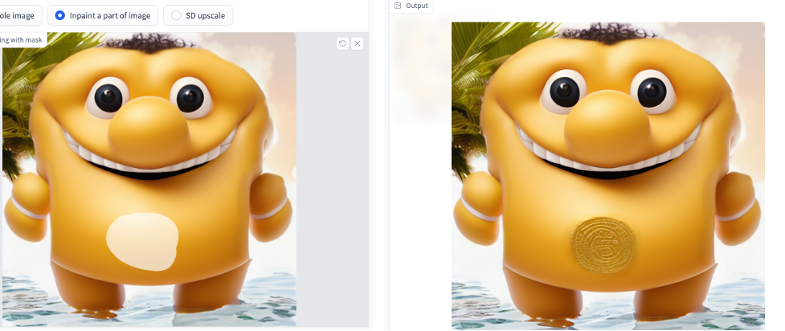 

And then tied it all together! 

How it Started            |  How its going 
:-------------------------:|:-------------------------:
  |  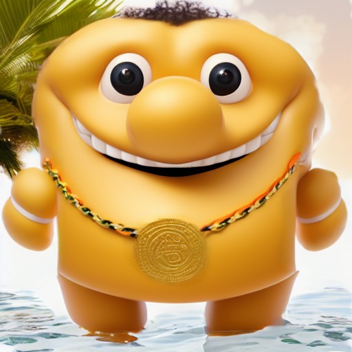 

This is just a starting point. Please revert to the [root directory](https://github.com/tescal2/stable-diffusion-webui) in order to see many other features. Happy Diffusing! 
